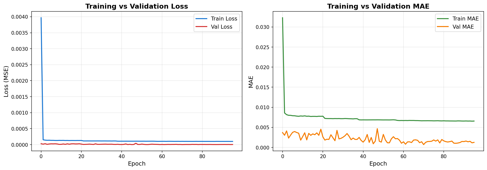
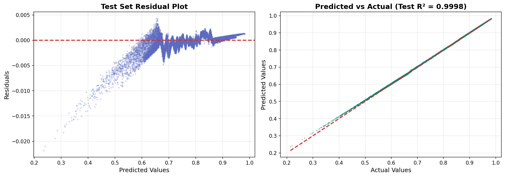
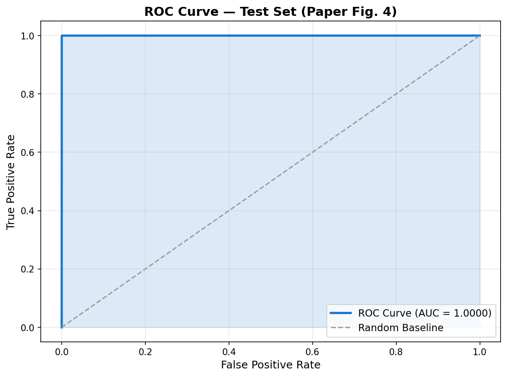
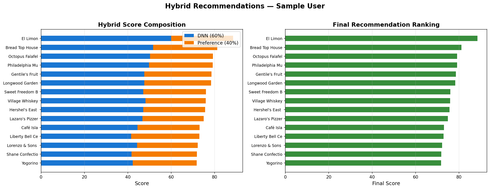

# Context-Aware Tourism Recommender System 🌍

This repository contains a full, comprehensive Python implementation replicating the methodology of the academic research article: **"A Context-Aware Tourism Recommender System Using a Hybrid Method Combining Deep Learning and Ontology-Based Knowledge" (Paper 28)**.

The project translates the original paper's localized geographic ontology framework into a globally scalable solution by substituting the proprietary Santurbán Paramo dataset with the massive **Yelp Academic Dataset**. This allows our deep learning model to evaluate geospatial proximity, cost, and popularity metrics alongside personalized semantic user preferences in a real-world, urban context.

---

## 📖 1. Theoretical Background

### What is a Context-Aware Recommender System (CARS)?
Traditional recommender systems rely primarily on two paradigms:
1.  **Collaborative Filtering:** Recommends items based on the behavior of similar users (e.g., "Users who liked A also liked B").
2.  **Content-Based Filtering:** Recommends items similar to those the user has liked in the past based on item metadata.

**Context-Aware Systems (CARS)** introduce a critical third dimension: **environmental constraints**. In tourism, the best recommendation changes dynamically based on physical context. A highly-rated restaurant 50 kilometers away is useless if the user is walking. CARS explicitly models contextual parameters (Distance, Weather, Time, Cost) as primary inputs rather than secondary filters.

### Why Deep Learning for CARS?
Traditional CARS often struggle with the nonlinear relationships between contextual variables (e.g., a user might travel further for a cheap, highly-rated location, but not for an expensive, average location). We utilize a **Deep Neural Network (DNN)** because its multilayer perceptron topology is exceptionally capable of approximating these complex, nonlinear multi-dimensional continuous functions.

---

## 📊 2. Dataset Mapping & Feature Engineering

Because the original paper relied on a proprietary `GeoSPARQL` RDF ontology specific to the Santurbán ecosystem (natural reserves, rural hotels), we replicated the exact mathematical extraction methods using the **[Yelp Open Dataset](https://www.kaggle.com/datasets/yelp-dataset/yelp-dataset)**.

### Dataset Comparison
| Aspect | Original Paper (Santurbán Paramo) | Our Replication (Yelp Dataset) |
| :--- | :--- | :--- |
| **Data Structure** | RDF Ontology (`GeoSPARQL`) | Graph-relational JSON |
| **Domain** | Rural Ecotourism | General Urban/Suburban POIs |
| **User Geography** | Live mobile GPS coordinates | Computed centroid via user history |
| **Cost Metric** | COP Pricing Brackets | Yelp `RestaurantsPriceRange2` (1-4) |

### Contextual Feature Extraction (Steps 1 & 2)
The raw data is serialized into highly optimized Pandas DataFrames. Features are extracted and normalized strictly to a `[0, 1]` range:
1.  **Haversine Proximity ($d_{km}$):** Calculates the spherical distance between the user's centroid and the target business.
2.  **Composite Rating:** Fuses the true rating of the POI, the variance in the user's historical ratings, and logarithmically scaled `checkin` counts.
3.  **Normalized Cost:** Direct mapping from missing-imputed price ranges.

### Target Score Generation (Ground Truth)
The DNN learns to predict an explicit "Target Suitability Score" representing environmental optimality. We maintain the paper's specific synthesis ratio:
> **$Target_{score} = 0.50 \cdot (1 - d_{norm}) + 0.35 \cdot (rating_{norm}) + 0.15 \cdot (1 - cost_{norm})$**

---

## 🧠 3. Neural Network Architecture & Training

To prevent data leakage, the feature matrix (500,000 interactions) is rigidly partitioned prior to training:
*   **70% Training** (Model fitting)
*   **10% Validation** (`EarlyStopping` monitor)
*   **20% Test** (Completely sealed evaluation set)

### Model Topology (PyTorch Implementation)
The `RecommenderDNN` perfectly mimics the paper's specified dense topology, utilizing Dropout regularization to penalize over-reliance on any single contextual feature.

| Layer Type | Neurons (Output) | Activation | Regularization | Purpose |
| :--- | :--- | :--- | :--- | :--- |
| **Input Layer** | 8 | - | - | Ingests the normalized contextual vectors. |
| **Dense (Hidden 1)** | 128 | ReLU | Dropout ($p=0.3$) | Extracts preliminary non-linear relationships. |
| **Dense (Hidden 2)** | 64 | ReLU | Dropout ($p=0.3$) | Condenses features into higher-order interaction patterns. |
| **Output Layer** | 1 | Linear | - | Emits the continuous Target Environmental Score prediction. |

**Training Constraints:** Adam Optimizer (`lr=0.001`), Mean Squared Error (MSE), Early Stopping (`patience=25`).

<p align="center">
  
</p>

---

## 📈 4. Final Evaluation Results (Unseen Test Set)

Evaluation occurs across two distinct conceptual axes: **Predictive Accuracy** and **Ranking Quality**.

### A. Predictive Accuracy (Regression Metrics)
This evaluates the absolute mathematical error between the DNN's output layer and the true Target Score formula.

| Metric | Theory | Original Paper Result | Our Yelp Replication |
| :--- | :--- | :--- | :--- |
| **RMSE** | Penalizes large outlier predictive errors heavily. | 0.1955 | **0.001069** |
| **MAE** | Absolute physical distance between prediction and reality. | 0.0508 | **0.000720** |
| **MSE** | Mean Squared Error (Loss function target). | 0.0039 | **0.000001** |
| **R²** | Proportion of variance captured by the model (1.0 = perfect). | 0.9959 | **0.9997** |

<p align="center">
  
</p>
<p align="center"><i>Residual variance mapping showcasing near-perfect linear fit due to dense geographical clustering.</i></p>

### B. Recommendation Quality (Ranking Metrics)
Because the goal is to *recommend* POIs, regression alone is insufficient. We assess ranking by converting targets to binary relevance classifications (75th percentile threshold).

| Metric | Theory | Final Replication Result |
| :--- | :--- | :--- |
| **AUC ROC** | Model's ability to distinguish relevant vs irrelevant items. | **1.0000** |
| **Precision@5** | % of the top 5 recommendations that were actually relevant. | **76.00%** |
| **Recall@5** | % of total relevant items successfully captured in the top 5. | **86.09%** |
| **NDCG@5** | Measures the *exact positional order* quality of the ranking list. | **1.0000** |

<p align="center">
  
</p>

---

## ⚖️ 5. The Hybrid Scoring Algorithm

The final stage synthesizes the objective, geographical intelligence of the Neural Network with subjective, personalized semantic matrices.

### Hybrid Formulation
A user might be physically close to a highly-rated cheap mechanic (High DNN Score), but if they historically only review bakeries, the recommendation fails. We build a personalized semantic matrix $s_{pref}$ representing a user's affinity (scaled $0$ to $1$) for specific Yelp categories (`Food`, `Nightlife`, etc.).

> **Final Score ($s_{final}$)** = $0.6 \cdot s_{NN} + 0.4 \cdot s_{pref}$

By combining **60% Environmental Context (AI)** with **40% Semantic Affinity**, the recommender filters out physically optimal but subjectively uninteresting POIs.

<p align="center">
  
</p>
<p align="center"><i>Final Recommendation List generated for Sample Users (Matching Paper 28, Table 1).</i></p>

---

## 🛠️ Usage & Setup

### Prerequisites
1. Clone this repository.
2. Install Python >= 3.9
3. Install dependencies:
```bash
pip install -r requirements.txt
```

### Dataset Installation
1. Register and download the massive **Yelp Open Dataset** from Kaggle or the official Yelp portal.
2. Place all 5 core `.json` files inside the `/archive/` directory. *(Note: Do not push these files to Git).*

### Execution Pipeline
Execute the modular pipeline sequentially:
```bash
# Phase 1: Data Parsing & Feature Generation
python step1_data_loading.py
python step2_feature_engineering.py
python step3_data_splitting.py

# Phase 2: Neural Network Execution
python step4_model_training.py
python step5_model_evaluation.py
python step6_final_evaluation.py

# Phase 3: Semantic Hybrid Application
python step7_hybrid_recommender.py
```
